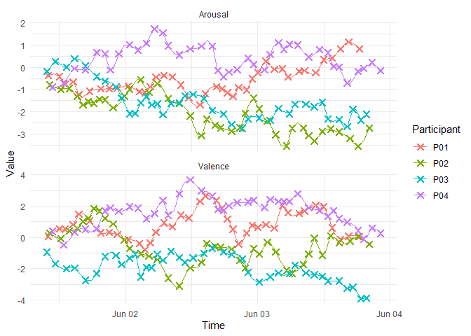
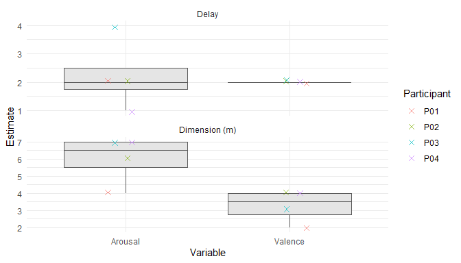
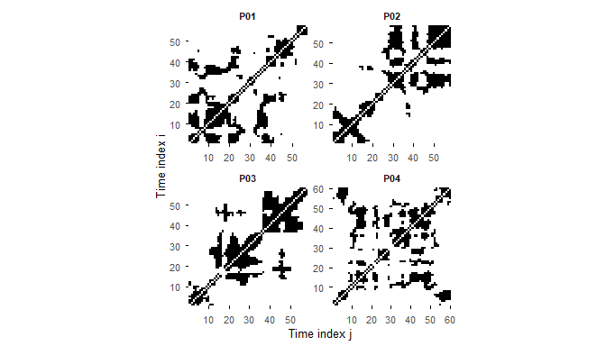

<!-- README.md is generated from README.qmd. Please edit README.qmd, not README.md. -->

# experdyn 

[](https://github.com/RealityBending/experdyn/actions/workflows/R-CMD-check.yaml)
[](https://github.com/RealityBending/experdyn/actions/workflows/pkgdown.yaml)

**experdyn** provides tools for analysing ESM/EMA (Experience Sampling
Method / Ecological Momentary Assessment) time series through the lens
of **nonlinear dynamics and complexity science**.

Participants in ESM studies answer repeated short questionnaires
throughout the day, producing irregularly-timed multivariate time series
of psychological states (mood, arousal, stress, …). **experdyn** offers
a complete pipeline from raw timestamps to interpretable nonlinear
measures.

## Installation

Install the development version from GitHub:

``` r
# install.packages("remotes")
remotes::install_github("RealityBending/experdyn")
```

``` r
library(experdyn)
```

## Example data

A typical ESM dataset has a timestamp column per observation, one column
identifying the participant, and one or more psychological variables.
**Any numeric column other than the timestamp and participant identifier
is treated as a variable** — no specific naming convention is required.

``` r
set.seed(42)
n_per <- 40   # observations per participant

make_participant <- function(id, t0, seed) {
  set.seed(seed)
  times <- t0 + cumsum(sample(c(3600, 5400, 7200), n_per, replace = TRUE))
  data.frame(
    Participant = id,
    timestamp   = times,
    Valence  = cumsum(rnorm(n_per, sd = 0.6)),
    Arousal  = cumsum(rnorm(n_per, sd = 0.4))
  )
}

esm_data <- rbind(
  make_participant("P01", as.POSIXct("2025-06-01 09:00:00"), seed = 1),
  make_participant("P02", as.POSIXct("2025-06-01 09:15:00"), seed = 2),
  make_participant("P03", as.POSIXct("2025-06-01 08:45:00"), seed = 3),
  make_participant("P04", as.POSIXct("2025-06-01 08:45:00"), seed = 4)
)

head(esm_data)
#>   Participant           timestamp    Valence    Arousal
#> 1         P01 2025-06-01 10:00:00 0.08000182 -0.3762597
#> 2         P01 2025-06-01 12:00:00 0.56251552 -0.4225898
#> 3         P01 2025-06-01 13:00:00 0.52825146 -0.7485773
#> 4         P01 2025-06-01 14:30:00 0.83041624 -0.6516719
#> 5         P01 2025-06-01 15:30:00 1.48187786 -1.2217112
#> 6         P01 2025-06-01 17:30:00 1.06730555 -1.0753348
```

## Preprocessing

Raw ESM data are irregularly sampled. `resample_timeseries()` detects
overnight gaps (by default \> 6 h), splits data into contiguous
subseries, and interpolates each variable onto a regular 60-minute grid
using natural cubic splines (linear interpolation is also available).

``` r
resampled <- resample_timeseries(
  esm_data,
  time_col        = "timestamp",
  participant_col = "Participant",
  target_frequency = 60,
  verbose         = TRUE
)
#> --- Preprocessing Complete ---
#> Original data points    : 160
#> Interpolated data points: 237
#> Usable subseries        : 4
#> Output resolution       : 1 observation every 60 minutes
#> Sampling frequency      : 1 observations per hour
#> ------------------------------
resampled$plot
```



## State-Space Embedding

Before building the state-space, choose the time delay *τ* (via Average
Mutual Information) and embedding dimension *m* (via False Nearest
Neighbours) for each variable.

``` r
params <- estimate_embedding_parameters(resampled, plot = TRUE)
#> Registered S3 method overwritten by 'quantmod':
#>   method            from
#>   as.zoo.data.frame zoo
params
#> ===== Embedding Parameter Estimation =====
#>   Recommended delay       : 2
#>   Recommended dim (m)     : 7
#>   Variables analysed      : 2
#>   Series/subseries used   : 4
#> 
#>   Variability across all variable-series estimates:
#>     Delay SD / IQR        : 0.83 / 0.00
#>     Dim SD / IQR          : 1.85 / 2.50
#> 
#>   Per-variable summary:
#> # A tibble: 2 × 6
#>   Variable n_series delay_median delay_iqr dim_median dim_iqr
#>   <chr>       <int>        <dbl>     <dbl>      <dbl>   <dbl>
#> 1 Arousal         4            2      0.75        6.5    1.5 
#> 2 Valence         4            2      0           3.5    1.25
#> 
#>   Plot                  : use `$plot` to inspect estimates
#> ==========================================
params$plot
```



Then, we can use `make_statespace()` to apply Takens’ delay-embedding
theorem: each point in the reconstructed state-space is a vector of
lagged observations. In a real analysis you would pass
`params$recommended_delay` and `params$recommended_dim`; here we use
fixed values so the README example is reproducible regardless of any
randomness in the parameter estimation step.

``` r
ss <- make_statespace(
  resampled,
  delay      = 1,
  dimensions = 2
)
ss
#> ========= Multivariate State Space =========
#>   Delay (rows)         : 1
#>   Dimensions           : 2
#>   Variables embedded   : 2
#>   Series processed     : 4
#>   Series embedded      : 4
#>   Embedded rows        : 233
#>   Data frame           : use `$embedded` to extract
#> ============================================
```

The `plot_statespace()` function projects the high-dimensional embedding
to 2-D using UMAP (or PCA as a fallback) so that the attractor geometry
is visible.

``` r
plot_statespace(ss, color_by = "ID")
```


## Indices

### Multivariate Sample Entropy (MvSampEn)

MSE quantifies the complexity (unpredictability) of the signal. Higher
values indicate more irregular, less predictable dynamics.

``` r
mse <- compute_mvsampen(ss, r = 0.2)
mse
#> ===== Multivariate Sample Entropy =====
#>   Statespace dimensions  : 2
#>   Tolerance (r)         : 0.200
#>   Variables used        : 2
#>   Participants          : 4
#>   Series                : 4
#> 
#> # A tibble: 4 × 5
#>   ID    n_series n_series_valid entropy entropy_sd_series
#>   <chr>    <int>          <int>   <dbl>             <dbl>
#> 1 P01          1              1   1.57                 NA
#> 2 P02          1              1   0.658                NA
#> 3 P03          1              1   1.57                 NA
#> 4 P04          1              0  NA                    NA
#> 
#>   Detailed per-series results: use `$series_entropy`
#> ========================================
```

### Recurrence Quantification Analysis (RQA)

RQA characterises how often and how consistently the system revisits
previous states. Key measures:

- **RR** — Recurrence Rate: overall density of recurrences.
- **DET** — Determinism: proportion of recurrences on diagonal lines
  (periodic / predictable structure).
- **L** / **Lmax** — Mean / maximum diagonal line length.
- **ENTR** — Shannon entropy of diagonal line lengths (structural
  richness).
- **LAM** / **TT** — Laminarity and Trapping Time (intermittent, laminar
  episodes).

``` r
rqa <- compute_rqa(ss, r = 1.5, verbose = TRUE)
#> --- RQA Complete ---
#>   Participants  : 4
#>   Series        : 4
#>   Tolerance (r) : 1.500
#>   min_diag / min_vert : 2 / 2
#> --------------------
rqa
#> ===== Recurrence Quantification Analysis =====
#>   Tolerance (r)          : 1.500
#>   Min diagonal (min_diag): 2
#>   Min vertical (min_vert): 2
#>   Participants           : 4
#>   Series                 : 4
#> 
#>   ID n_series n_series_valid    RR   DET     L Lmax  ENTR   LAM    TT Vmax
#>  P01        1              1 0.227 0.906 4.260   56 1.674 0.898 4.012   12
#>  P02        1              1 0.224 0.924 4.560   57 1.835 0.923 4.323   12
#>  P03        1              1 0.232 0.951 5.368   40 2.057 0.941 4.665   17
#>  P04        1              1 0.222 0.868 3.789   29 1.561 0.866 3.681   12
#> 
#>   Per-series results : use `$series_rqa`
#>   Recurrence data    : use `$recurrence_data` (for custom plots)
#> ===============================================
```

The **recurrence plot** reveals the temporal structure at a glance:
diagonal lines indicate periodic recurrences; isolated points indicate
stochastic behaviour.

``` r
plot_rqa(rqa, facet_by = "participant")
```



## Roadmap

Below are candidate features and improvements planned for future
releases. Contributions and suggestions welcome via [GitHub
Issues](https://github.com/RealityBending/experdyn/issues).

### New complexity measures

- **Multiscale Sample Entropy (MSE)** — apply SampEn at multiple
  coarse-graining scales to capture complexity across timescales, as
  introduced by Costa et al. (2002).
- **Permutation Entropy** — ordinal-pattern based entropy;
  computationally lightweight and robust to noise, useful as a
  complement or sanity-check to MvSampEn.
- **Detrended Fluctuation Analysis (DFA)** — estimate long-range
  temporal correlations and fractal scaling exponents, relevant for
  distinguishing 1/f noise from white noise in ESM data.
- **Correlation Dimension (D2)** — estimate the fractal dimension of the
  reconstructed attractor via the Grassberger–Procaccia algorithm.
- **Lyapunov Exponent** — quantify the rate of divergence of nearby
  trajectories as a direct measure of chaotic dynamics.

### Temporal dynamics within participants

- **Windowed / rolling RQA and entropy** — slide a fixed-width window
  across each subseries to produce time-varying complexity trajectories,
  enabling study of intra-individual change across the day or week.
- **Change-point detection** — identify structural transitions in the
  attractor based on rolling RQA measures (e.g., sudden drop in DET
  indicating a phase transition).

### Performance and scalability

- **Rcpp acceleration for RQA and MvSampEn** — replace the pure-R O(n²)
  distance loops with compiled C++ routines via `Rcpp`, enabling routine
  use on longer series (n \> 300).
- **Sparse / chunked distance matrix** — avoid materialising the full
  n×n distance matrix; enumerate recurrences on-the-fly using spatial
  indexing (e.g., k-d trees).
